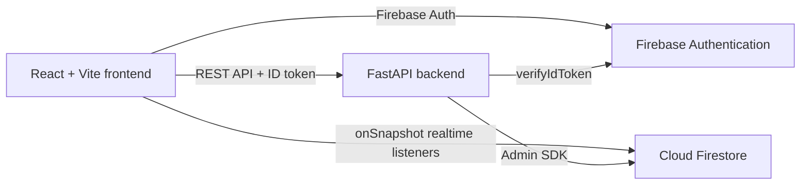

# JOINLY

JOINLY is a social planning app for finding people to join your activities. Users can create plans, discover activities nearby, connect with other users, send join requests, and chat in real time.

The main idea is simple: turn "I wish someone could join me" into "Who wants to come?"

## Live Application

- **Live frontend:** [https://joinly-in.onrender.com](https://joinly-in.onrender.com)
- **Backend health check:** [https://joinly-krcq.onrender.com/health](https://joinly-krcq.onrender.com/health)
- **Backend API docs:** [https://joinly-krcq.onrender.com/docs](https://joinly-krcq.onrender.com/docs)

To use the app, open the frontend, create an account or sign in, and complete the profile setup. The backend health check should return `status: ok` and `firebase: configured`.

## How The App Works

1. Create an account with email/password or Google.
2. Complete your profile with a name, username, city, interests, and avatar.
3. Create a plan for an activity such as food, movies, travel, sports, study, or events.
4. Discover plans by city, category, or search text.
5. Open a user's profile to see their hosted plans.
6. Send a join request to a plan and wait for the host to accept it.
7. Start a one-to-one conversation and receive realtime message updates.

## Features

- Create, edit, and delete plans as the host.
- Discover plans by text, category, and city.
- Search users by username.
- Public profiles with bio, interests, location, avatar, and hosted plans.
- Join requests with host approval.
- Notifications for plan activity.
- Realtime one-to-one chat with unread-message indicators.
- Email/password login, Google login, and password reset.
- Local avatars that do not require Firebase Storage.

## How The System Works



The frontend is the user interface. It sends authenticated API requests to the FastAPI backend. Firebase Authentication handles login and gives the frontend an ID token. The backend verifies that token before protected operations.

The backend uses the Firebase Admin SDK for authorized database operations. The frontend uses Firestore listeners for realtime chat and unread-message updates. Firestore rules make sure users can access only the data they are allowed to see.

## Technology Stack

- **Frontend:** React 19, Vite, React Router, Axios, Firebase Web SDK, Lucide React, Tailwind CSS
- **Backend:** Python 3.11+, FastAPI, Uvicorn, Pydantic Settings, Firebase Admin SDK
- **Database and auth:** Firebase Authentication and Cloud Firestore
- **Hosting:** Render Static Site for the frontend and Render Web Service for the backend

## Project Structure

```text
backend/
  app/
    core/          Settings and environment configuration
    dependencies/  Firebase authentication dependency
    routes/        API endpoints
    schemas/       Request and response models
    services/      Firebase, user, plan, notification, and message logic
  requirements.txt
frontend/
  src/
    components/   Shared UI components
    context/      Authentication and toast state
    pages/        Login, home, discover, plans, profile, and messages
    services/     API and Firebase clients
    utils/        Shared constants
  public/avatars/ Local avatar assets
firestore.rules   Firestore security rules
README.md         Project overview and setup
```

## Run Locally

### 1. Configure Firebase variables

Copy `frontend/.env.example` to `frontend/.env` and add your Firebase Web App values.

Copy `backend/.env.example` to `backend/.env` and add your Firebase Admin credentials. Never commit service-account JSON or private keys.

### Frontend

```bash
cd frontend
npm ci
npm run dev
```

The frontend runs on `http://localhost:5173`.

### Backend

From the repository root:

```bash
pip install -r backend/requirements.txt
uvicorn backend.app.main:app --reload --host 127.0.0.1 --port 8000
```

The backend runs on `http://localhost:8000`.

Health check: [http://localhost:8000/health](http://localhost:8000/health)

The Vite development server proxies `/api` requests to the backend.

## Deployment

Use the complete Render checklist in [DEPLOYMENT.md](DEPLOYMENT.md).

The production sequence is:

1. Create/configure Firebase Authentication and Firestore.
2. Deploy the backend as a Render Web Service.
3. Deploy the frontend as a Render Static Site.
4. Add the Render frontend domain to Firebase Authorized Domains.
5. Set backend `CORS_ORIGINS` to the Render frontend URL.
6. Set frontend `VITE_API_BASE_URL` to the Render backend URL.
7. Publish `firestore.rules`.
8. Test authentication, profile editing, plan creation/deletion, username search, chat, and unread messages.

Read [DEPLOYMENT.md](DEPLOYMENT.md) for the complete Render and Firebase setup, including environment variables, CORS, authorized domains, Firestore rules, and production testing.

## Security And Limits

- Firestore rules protect profiles, plans, join requests, notifications, conversations, and messages.
- The backend verifies Firebase ID tokens in production.
- Demo authentication is disabled by default.
- Each user can send up to 100 messages per day by default.
- Each message can contain up to 2,000 characters.
- Conversations return up to 100 messages by default.
- Firebase Admin credentials must stay on the backend and must never be exposed in the frontend.

## Validation

The current project has been validated with:

```bash
cd frontend && npm run build
python -m compileall -q backend
```

Vite may print deprecation and bundle-size warnings during build; they do not block the production bundle.
