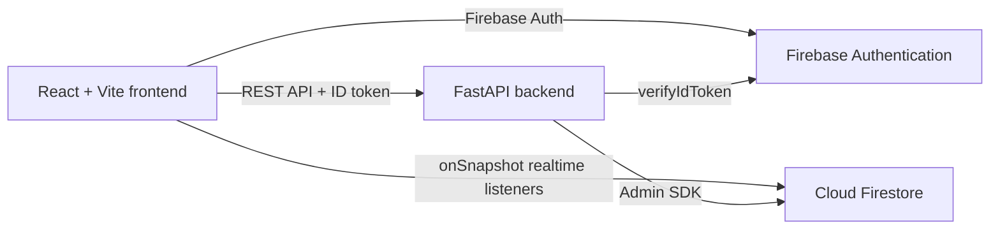

# JOINLY

JOINLY is a city-based social planning app where people can create plans, discover activities, find users by username, and chat in real time.

It is designed around a simple idea: turn "I wish someone could join me" into "Who wants to come?"

## Product Showcase

### Core experience

- Create activity plans for movies, food, cafes, travel, events, sports, study, and more.
- Discover plans by text, category, and city.
- Search people by username.
- Open a public profile with hosted plans, bio, interests, location, and avatar.
- Send join requests and let plan hosts accept or decline them.
- Manage created plans, including deleting plans as the host.
- Receive notifications for plan activity.
- Start one-to-one conversations from a user profile.
- See realtime chat updates with Firestore `onSnapshot`.
- See a realtime red unread-message indicator beside the message icon.
- Use password reset and Google sign-in through Firebase Authentication.
- Choose from local anime/cartoon avatars without storing uploaded image files.

### Safety and limits

- Firestore rules restrict profile, plan, join-request, conversation, and message access.
- Backend verifies Firebase ID tokens in production.
- Demo authentication is disabled by default.
- Message limits protect the free Firebase plan:
  - 100 messages per user per day by default.
  - 2,000 characters per message.
  - 100 messages returned per conversation request.
- Firebase Storage is not required by the current implementation.

## Technology Stack

### Frontend

- React 19
- Vite
- React Router
- Axios
- Firebase Web SDK
- Lucide React icons
- Tailwind CSS v4 Vite integration

### Backend

- Python 3.11+
- FastAPI
- Uvicorn
- Pydantic Settings
- Firebase Admin SDK
- Firestore
- Firebase Authentication token verification

### Data and infrastructure

- Firebase Authentication: email/password, Google, password reset
- Cloud Firestore: profiles, plans, join requests, notifications, conversations, messages
- Render: recommended backend web service and frontend static site host

## Architecture



The backend owns writes and authorization-sensitive operations. The frontend uses Firestore listeners for realtime conversation and unread-state updates after Firebase rules are published.

## Project Structure

```text
backend/
  app/
    core/          Settings and environment configuration
    dependencies/  Firebase auth dependency
    routes/        FastAPI API routes
    schemas/       Pydantic request/response models
    services/      Firebase, user, plan, notification, and message logic
  requirements.txt
frontend/
  src/
    components/   Shared navigation, cards, avatars, and UI
    context/      Auth and toast state
    pages/        Auth, discovery, plans, profile, and messages
    services/     Firebase and API clients
    utils/        App constants and formatting helpers
  public/avatars/ Local anime/cartoon avatar assets
firestore.rules   Firestore security rules
DEPLOYMENT.md     Render and Firebase deployment instructions
```

## Run Locally

### Frontend

```bash
cd frontend
npm ci
npm run dev
```

The frontend runs on `http://localhost:5173`.

### Backend

From the repository root:

```bash
pip install -r backend/requirements.txt
uvicorn backend.app.main:app --reload --host 127.0.0.1 --port 8000
```

The backend runs on `http://127.0.0.1:8000`.

Health check:

```text
http://127.0.0.1:8000/health
```

## Environment Files

Frontend variables belong in `frontend/.env`. Use `frontend/.env.example` as the template.

Backend variables belong in `backend/.env`. Use `backend/.env.example` as the template.

Never commit Firebase Admin service-account JSON or private keys.

## Deployment

Use the complete Render checklist in [DEPLOYMENT.md](DEPLOYMENT.md).

The production sequence is:

1. Create/configure Firebase Authentication and Firestore.
2. Deploy the backend as a Render Web Service.
3. Deploy the frontend as a Render Static Site.
4. Add the Render frontend domain to Firebase Authorized Domains.
5. Set backend `CORS_ORIGINS` to the Render frontend URL.
6. Set frontend `VITE_API_BASE_URL` to the Render backend URL.
7. Publish `firestore.rules`.
8. Test authentication, profile editing, plan creation/deletion, username search, chat, and unread messages.

## Validation

The current project has been validated with:

```bash
cd frontend && npm run build
python -m compileall -q backend
```

Vite may print deprecation and bundle-size warnings during build; they do not block the production bundle.
