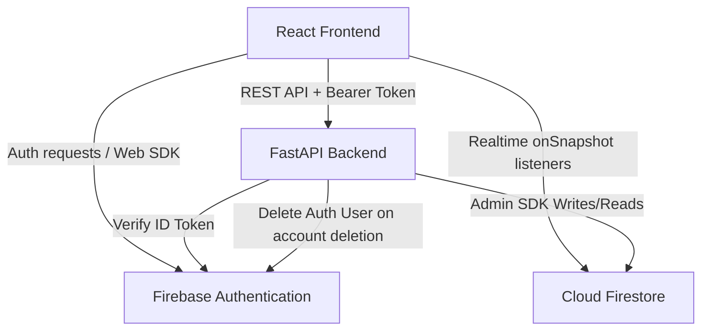
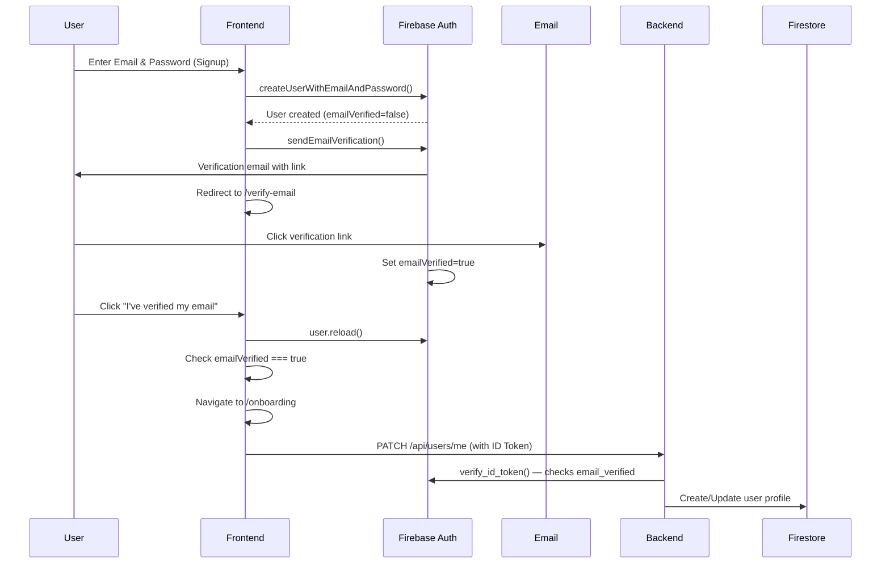
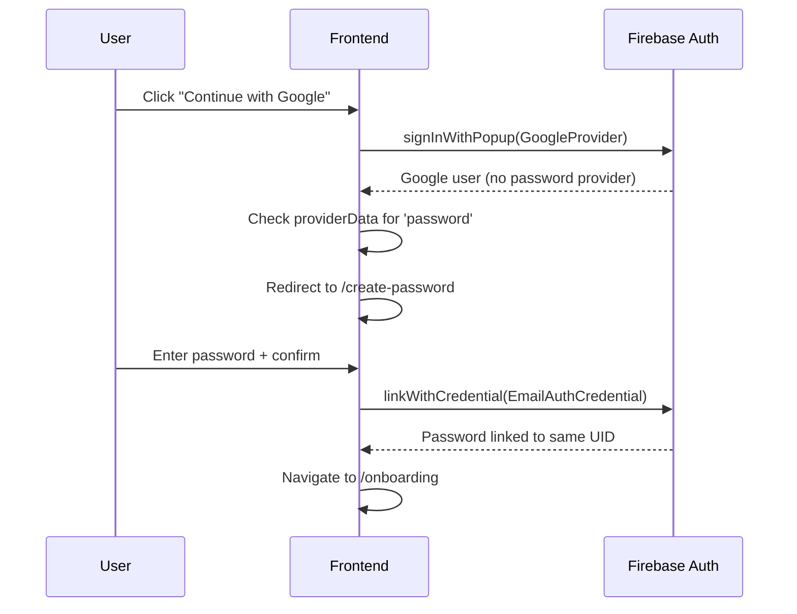
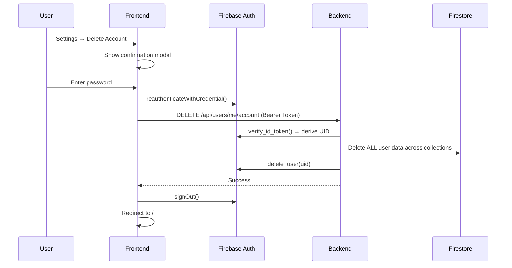

# Application Documentation

## 1. Application Overview

* **Application name**: JOINLY
* **One-line description**: A social planning app for finding people to join your activities.
* **Detailed purpose**: JOINLY is designed to turn the thought "I wish someone could join me" into actionable plans. It allows users to create activities (plans), discover activities nearby, connect with other users, send join requests, and chat in realtime to coordinate.
* **Problems it solves**: Helps people find companions for activities like eating out, movies, travel, sports, study, or events when their existing friends are unavailable.
* **Target users**: People looking to socialize and find activity partners in their city.
* **Main use cases**: 
  - Creating a plan for an activity.
  - Discovering local plans based on category or city.
  - Requesting to join a host's plan.
  - Realtime chatting to coordinate an activity.
* **Current application status**: MVP ready / Production deployment configured.
* **Production/development status**: Can be run locally and deployed to Render.
* **Repository/project structure summary**: A monorepo containing a React/Vite frontend (`/frontend`) and a Python/FastAPI backend (`/backend`).

## 2. Core Functionalities

### Authentication & Registration
* **Purpose**: Secure user access and onboarding.
* **Who can use it**: Anyone.
* **User flow (Email/Password)**:
  1. User enters email, password, and confirm password on the Signup page.
  2. Firebase `createUserWithEmailAndPassword` creates a Firebase Auth user.
  3. Firebase `sendEmailVerification` sends a verification link to the user's email.
  4. User is redirected to the "Verify your email" screen.
  5. User clicks the link in their email → Firebase sets `emailVerified = true`.
  6. User returns to JOINLY and clicks "I've verified my email".
  7. Frontend calls `user.reload()` and checks `emailVerified`.
  8. If verified → user proceeds to onboarding/profile creation.
  9. If not verified → error message, user stays on verification screen.
* **User flow (Google)**:
  1. User clicks "Continue with Google" → Firebase Google Sign-In popup.
  2. After successful Google auth, frontend checks if `password` provider is linked.
  3. If NOT linked → user is redirected to "Create Password" screen.
  4. User sets a password → Firebase `linkWithCredential` links email/password to the SAME Firebase UID.
  5. User proceeds to onboarding.
  6. If password IS already linked → user proceeds directly.
* **Frontend behavior**: Uses Firebase Web SDK for both Google Sign-In and Email/Password creation. Maintains user session via AuthContext. Tracks `needsEmailVerification` and `needsPasswordSetup` states.
* **Backend behavior**: Validates Firebase ID tokens on protected routes. Rejects unverified email/password users from completing onboarding (PATCH /users/me returns 403).
* **API involved**: `/api/auth/me`.
* **Database interaction**: None for auth itself. Profile creation happens via `/api/users/me` after verification.
* **Authentication/authorization requirements**: None for signup/login pages. ID token required for `/me`.

### Account Deletion
* **Purpose**: Allow users to permanently delete their JOINLY account and all associated data.
* **Who can use it**: Authenticated users.
* **User flow**:
  1. User goes to Settings → Account Details → Delete Account.
  2. Confirmation modal appears with warning text and password input.
  3. User enters password → Firebase reauthentication via `reauthenticateWithCredential`.
  4. If password incorrect → error, account NOT deleted.
  5. If reauthentication succeeds → frontend calls `DELETE /api/users/me/account`.
  6. Backend deletes ALL Firestore data for the user's UID.
  7. Backend deletes the Firebase Auth user.
  8. Frontend signs out and redirects to landing page.
  9. Username becomes available for new users.
* **Frontend behavior**: Uses existing Modal component. Password reauthentication via Firebase Client SDK. Calls backend DELETE endpoint with fresh ID token.
* **Backend behavior**: `AccountService.delete_account(uid)` deletes data from all collections, then deletes Firebase Auth user. UID is derived from the verified ID token, never from the request body.
* **API involved**: `DELETE /api/users/me/account`.
* **Data deleted**: `users`, `plans` (hosted), `join_requests`, `conversations`, `messages`, `notifications`, `blocked_users`, `message_requests`, `chat_preferences`, `chat_delete_requests`, `message_usage`.
* **Reports**: The current `POST /api/safety/report` endpoint does not persist to Firestore, so there are no report documents to clean up.

### User Profiles
* **Purpose**: Allow users to share information about themselves (bio, interests, city) to build trust.
* **Who can use it**: Authenticated users.
* **User flow**: After signup and verification, users complete onboarding (name, username, DOB, city). They can view and edit their profile, and view other public profiles.
* **Frontend behavior**: Displays user details and avatars. Fetches profiles by username.
* **Backend behavior**: Validates age (must be at least 17). Ensures usernames are unique. Generates mock avatars via `ui-avatars.com`. Strips private information (like email) from public profile responses. Blocks unverified email/password users from completing onboarding.
* **API involved**: `/api/users/me`, `/api/users/{username}`, `PATCH /api/users/me`, `POST /api/users/me/profile-image`.
* **Database interaction**: Reads/Writes to `users` collection.
* **Important validations**: Age >= 17, username uniqueness, email verification for email/password users.

### Plans (Activities)
* **Purpose**: Create, discover, and manage activities.
* **Who can use it**: Authenticated users with complete profiles.
* **User flow**: Host creates a plan with details (category, title, time, location). Other users search/filter plans and view plan details. Plan locations are clickable. Clicking a plan location opens Google Maps using a Google Maps Search URL generated from the existing location string (no API key required).
* **Frontend behavior**: Forms for creating/editing plans. Search bar and filters on the Discover page. Clickable location links are dynamically generated client-side using `encodeURIComponent()` without needing a new Firestore collection or field.
* **Backend behavior**: Validates that the user's profile is complete before allowing plan creation. Handles search queries (by category, city, host, or text).
* **API involved**: `POST /api/plans`, `GET /api/plans`, `GET /api/plans/{id}`, `PATCH /api/plans/{id}`, `DELETE /api/plans/{id}`.
* **Database interaction**: Reads/Writes to `plans` collection.

### Join Requests
* **Purpose**: Manage participation in plans.
* **Who can use it**: Authenticated users with complete profiles (to request); Plan Hosts (to approve/decline).
* **User flow**: User clicks "Join" on a plan. Host sees the request and accepts or declines it.
* **Frontend behavior**: Buttons to request join, accept, or decline.
* **Backend behavior**: Validates profile completeness. Checks permissions to ensure only hosts can accept/decline.
* **API involved**: `POST /api/plans/{id}/join`, `GET /api/plans/{id}/requests`, `PATCH /api/join-requests/{req_id}`, `GET /api/join-requests/me`.
* **Database interaction**: Reads/Writes to `join_requests` collection.

### Realtime Messaging/Chat
* **Purpose**: Coordinate plans securely without sharing phone numbers.
* **Who can use it**: Authenticated users who are participants in a conversation.
* **User flow**: Users can message others from their profile or after a join request is accepted. Messages appear instantly.
* **Frontend behavior**: Listens to Firestore `messages` and `conversations` collections in realtime using `onSnapshot`. Displays unread indicators.
* **Backend behavior**: Validates message limits (100/day) and length (2,000 chars). Creates/updates conversations. Handles message requests, pinning, and deletion.
* **API involved**: `POST /api/messages/{user_id}`, `GET /api/messages`, `GET /api/messages/{user_id}`, and various chat preference endpoints.
* **Database interaction**: Direct reads via Firestore SDK (frontend). Writes via Backend to `messages` and `conversations`.

### Notifications
* **Purpose**: Alert users about plan updates and join requests.
* **Who can use it**: Authenticated users.
* **User flow**: User receives a notification when someone requests to join their plan, or a host accepts their request.
* **Frontend behavior**: Displays a notification bell and list. Realtime listener via Firestore.
* **Backend behavior**: Automatically generates notifications during specific actions (e.g., join request updates). Provides endpoints to mark as read.
* **API involved**: `GET /api/notifications`, `PATCH /api/notifications/{id}/read`.
* **Database interaction**: Backend creates in `notifications`. Frontend listens/reads.

### Safety Features
* **Purpose**: Maintain a safe environment.
* **Who can use it**: Authenticated users.
* **User flow**: Users can block or report other users.
* **Backend behavior**: Blocks prevent messaging and viewing profiles. Reports are logged (note: current report endpoint returns success but does not persist to Firestore).
* **API involved**: `POST /api/users/blocked/{id}`, `POST /api/safety/report`.

## 3. User Roles & Permissions

| Role | Permissions | Restrictions |
| ---- | ----------- | ------------ |
| Normal User | Read public profiles, read plans, search, request to join, send messages. | Must complete onboarding to create plans/join. Subject to message rate limits. Can only read/edit own profile. |
| Plan Host | Update or delete plans they created. Accept/decline join requests for their plans. | Cannot edit/delete others' plans. |
| Admin | Not implemented. | The API receives user reports but no admin dashboard exists. |

*Authorization logic*: 
- Handled primarily by **Firestore Security Rules** which validate `request.auth.uid`.
- Backend endpoints verify the Firebase ID token and ensure users only modify their own resources.

## 4. Technology Stack

| Layer | Technology | Version | Purpose |
| ----- | ---------- | ------- | ------- |
| Frontend | React | 19.1.0 | UI Framework |
| Frontend | Vite | 8.3.0 | Build tool & dev server |
| Frontend | Tailwind CSS | 4.3.3 | Styling |
| Frontend | React Router | 7.18.3 | Client-side routing |
| Frontend | Firebase Web SDK | 12.19.0 | Auth, Email Verification, Realtime DB Listeners |
| Frontend | Axios | 1.20.0 | HTTP Client for API |
| Backend | Python | 3.11+ | Backend language |
| Backend | FastAPI | Latest | API Framework |
| Backend | Uvicorn | Latest | ASGI Web Server |
| Backend | Firebase Admin | Latest | DB/Auth management |
| Database | Cloud Firestore | N/A | NoSQL Database |
| Infra | Render | N/A | Hosting (Static Site & Web Service) |

## 5. High-Level Architecture



* **Client layer**: React application running in the browser. Handles UI state, routing, realtime DB listeners, Firebase email verification, and Google password linking.
* **Backend/API layer**: FastAPI application exposing REST endpoints for business logic, validation, controlled writes, and account deletion.
* **Authentication layer**: Firebase Auth handles credentials, email verification, and issues ID tokens. The backend validates these tokens.
* **Database layer**: Cloud Firestore. The backend writes data, the frontend reads data (often in realtime) governed by Firestore Security Rules.

## 6. Detailed Frontend Architecture

```text
frontend/
├── public/
│   └── avatars/         # Local fallback avatars
├── src/
│   ├── assets/          # Static assets
│   ├── components/      # Reusable UI components (Navbar, ProtectedRoute, Modal)
│   ├── context/         # React Context (AuthContext, ToastContext)
│   ├── hooks/           # Custom React hooks
│   ├── pages/           # Route views (Login, Signup, VerifyEmail, CreatePassword, Home, etc.)
│   ├── services/        # API configuration (axios), Firebase init, auth helpers
│   ├── utils/           # Helper functions/constants
│   ├── App.jsx          # Main routing component
│   └── main.jsx         # Application entry point
├── index.html           # HTML template
├── package.json         # Dependencies
└── vite.config.js       # Vite build & proxy config
```

| Component/Page | Purpose | Dependencies | API/Service Used |
| -------------- | ------- | ------------ | ---------------- |
| `App.jsx` | Routing and Layout | React Router | None |
| `AuthContext` | Global user session state, verification/password flags | Firebase Auth | `auth.onAuthStateChanged`, `/api/users/me` |
| `ProtectedRoute` | Auth guard with verification/password redirects | AuthContext | None |
| `api.js` | Axios instance with interceptors | Axios | Attaches Firebase ID token to headers |
| `auth.js` | Firebase auth helpers | Firebase SDK | signUp, logIn, sendVerificationEmail, linkPasswordToAccount, reauthenticateUser |
| `Signup.jsx` | Email/Password signup with Firebase verification | Firebase SDK | `createUserWithEmailAndPassword`, `sendEmailVerification` |
| `VerifyEmail.jsx` | Email verification waiting screen | Firebase SDK | `user.reload()`, `sendEmailVerification` |
| `CreatePassword.jsx` | Google user password linking | Firebase SDK | `linkWithCredential` |
| `Settings.jsx` | Account details, password change, account deletion | Firebase SDK, API | `reauthenticateWithCredential`, `DELETE /api/users/me/account` |
| `Messages.jsx` | Chat interface | Firestore SDK | Direct Firestore listeners, `/api/messages` |

## 7. Detailed Backend Architecture

```text
backend/
├── app/
│   ├── core/            # Configuration (Settings, env vars)
│   ├── dependencies/    # FastAPI Dependencies (Auth verification)
│   ├── routes/          # API route handlers (Controllers)
│   ├── schemas/         # Pydantic validation models
│   ├── services/        # Business logic & DB interaction
│   │   ├── firebase.py          # Firebase Admin init
│   │   ├── user_service.py      # User CRUD & blocking
│   │   ├── plan_service.py      # Plan CRUD & search
│   │   ├── join_request_service.py  # Join request handling
│   │   ├── message_service.py   # Messaging & conversations
│   │   ├── notification_service.py  # Notifications
│   │   └── account_service.py   # Account deletion (ALL data cleanup)
│   └── main.py          # FastAPI application entry point
├── .env.example         # Environment variables template
└── requirements.txt     # Python dependencies
```

| Module | Responsibility | Important Files |
| ------ | -------------- | --------------- |
| `core` | Environment variable management | `config.py` |
| `dependencies` | Token validation middleware | `auth.py` |
| `routes` | API endpoint definitions | `auth.py`, `plans.py`, `users.py`, `messages.py` |
| `schemas` | Request/Response data validation | `user.py`, `plan.py`, `message.py` |
| `services` | Core business logic and Firestore Admin calls | `user_service.py`, `plan_service.py`, `message_service.py`, `account_service.py`, `firebase.py` |

## 8. API Architecture

**Base URL**: `/api` (Proxied via Vite locally, set via `VITE_API_BASE_URL` in production)
**CORS**: Configured in FastAPI via `CORS_ORIGINS`.
**Authentication**: Most endpoints require a Firebase ID token passed in the `Authorization: Bearer <token>` header.

### Authentication (`/api/auth`)
| Method | Endpoint | Purpose | Authentication |
| ------ | -------- | ------- | -------------- |
| GET | `/me` | Check auth status | Required |

### Users (`/api/users`)
| Method | Endpoint | Purpose | Authentication |
| ------ | -------- | ------- | -------------- |
| GET | `/me` | Get current user profile | Required |
| PATCH | `/me` | Update current user profile | Required (email verified for email/password users) |
| DELETE | `/me/account` | Delete account and ALL associated data | Required |
| GET | `/{username}` | Get public profile by username | Required |
| GET | `/search` | Search users by username | Required |
| POST | `/me/profile-image` | Set mock profile image | Required |
| POST | `/blocked/{id}` | Block a user | Required |

### Plans (`/api/plans`)
| Method | Endpoint | Purpose | Authentication |
| ------ | -------- | ------- | -------------- |
| GET | `` | Search/filter plans | Required |
| POST | `` | Create a new plan | Required |
| GET | `/{plan_id}` | Get plan details | Required |
| PATCH | `/{plan_id}` | Update plan details | Required |
| DELETE| `/{plan_id}` | Delete a plan | Required |
| POST | `/{plan_id}/join` | Request to join plan | Required |
| GET | `/{plan_id}/requests`| List requests for a plan | Required |

### Join Requests (`/api/join-requests`)
| Method | Endpoint | Purpose | Authentication |
| ------ | -------- | ------- | -------------- |
| PATCH | `/{req_id}` | Accept/Decline request | Required |
| GET | `/me` | Get user's outgoing requests | Required |
| GET | `/incoming` | Get host's incoming requests | Required |
| GET | `/my-plans` | Fetch created/joined plans | Required |

### Messages (`/api/messages`)
| Method | Endpoint | Purpose | Authentication |
| ------ | -------- | ------- | -------------- |
| GET | `` | Get all conversations | Required |
| POST | `/{user_id}` | Send a message | Required |
| GET | `/{user_id}` | Get messages with user | Required |
| POST | `/{user_id}/read` | Mark messages as read | Required |
| GET | `/unread-count` | Get total unread count | Required |

### Notifications & Safety
| Method | Endpoint | Purpose | Authentication |
| ------ | -------- | ------- | -------------- |
| GET | `/api/notifications`| Get user notifications | Required |
| PATCH | `/api/notifications/{id}/read` | Mark as read | Required |
| POST | `/api/safety/report`| Report a user | Required |

## 9. Database Architecture

Cloud Firestore is used. Schema is NoSQL Document-based.

### Collection: `users`
| Field | Type | Required | Description |
| ----- | ---- | -------- | ----------- |
| `id` | String | Yes | Firebase Auth UID |
| `email` | String | Yes | User email (hidden from public) |
| `username` | String | Yes | Unique handle |
| `dateOfBirth` | String | Yes | Used to calculate age |
| `city` | String | Yes | Primary location |

### Collection: `plans`
| Field | Type | Required | Description |
| ----- | ---- | -------- | ----------- |
| `id` | String | Yes | Document ID |
| `hostId` | String | Yes | ID of user who created plan |
| `category` | String | Yes | e.g. Food, Sports, Travel |
| `title` | String | Yes | Plan name |
| `date` / `startTime` | String | Yes | Schedule info |
| `status` | String | Yes | "active", "cancelled", etc. |

### Collection: `join_requests`
| Field | Type | Required | Description |
| ----- | ---- | -------- | ----------- |
| `planId` | String | Yes | ID of the plan |
| `requesterId` | String | Yes | ID of user requesting |
| `hostId` | String | Yes | ID of plan host |
| `status` | String | Yes | "pending", "accepted", "declined" |

### Collection: `messages` & `conversations`
* `conversations`: Holds `participants` (array of UIDs), `lastMessage`, `lastMessageAt`, `unreadCounts`.
* `messages`: Holds `conversationId`, `senderId`, `recipientId`, `text`, `createdAt`.

### Collection: `notifications`
| Field | Type | Required | Description |
| ----- | ---- | -------- | ----------- |
| `userId` | String | Yes | Recipient of notification |
| `type` | String | Yes | Notification type |
| `relatedPlanId` | String | No | Associated plan |
| `relatedUserId` | String | No | Associated user |
| `read` | Boolean | Yes | Read status |

### Collection: `blocked_users`
* Document ID: `{blockerId}_{blockedId}`
* Fields: `blockerId`, `blockedId`, `createdAt`.

### Collection: `message_requests`
* Document ID: sorted composite of two UIDs.
* Fields: `requesterId`, `recipientId`, `status`, `createdAt`.

### Collection: `chat_preferences`
* Document ID: `{userId}_{otherUserId}`
* Fields: `userId`, `otherUserId`, `pinned`, `hidden`.

### Collection: `chat_delete_requests`
* Fields: `conversationId`, `requesterId`, `recipientId`, `status`.

### Collection: `message_usage`
* Document ID: user's UID
* Fields: `date`, `count` (daily message counter for rate limiting).

### Obsolete Collection: `signup_otps`
* **Status**: DEPRECATED. No longer used by the application.
* Previously stored temporary OTPs for email signup verification. All code references have been removed.
* Existing documents in this collection can be safely deleted from the Firebase Console.

### Security Rules
Defined in `firestore.rules`.
* Users can only modify their own profile.
* Only the Host can update/delete their plans.
* Direct Chat access is restricted strictly to users inside the `participants` array of a conversation.

## 10. Authentication & Authorization

### Email/Password Signup Flow


### Google Signup Flow


### Account Deletion Flow


* Password handling is entirely managed by Firebase Auth (never stored in Firestore or localStorage).
* Protected routes check the token using FastAPI dependency `get_current_user`.
* Role-based access is primarily Host vs. Participant, enforced at the service layer in the backend.
* Unverified email/password users are blocked from PATCH /users/me (403 error).
* The UID for account deletion is ALWAYS derived from the verified ID token, never from the request body.

## 11. Data Flow

**Standard REST Flow (e.g., Create Plan):**
```text
User -> Frontend Form -> axios.post('/api/plans') -> FastAPI Route -> PlanService -> Firebase Admin (Firestore) -> Response -> Frontend -> User
```

**Realtime Flow (e.g., Receiving a Message):**
```text
User A -> Frontend -> axios.post('/api/messages/{id}') -> FastAPI -> Firebase Admin (Firestore write)
(Meanwhile)
User B Frontend (onSnapshot listener) <- Cloud Firestore pushes update <- User B UI updates instantly
```

**Account Deletion Flow:**
```text
User -> Reauthenticate -> DELETE /api/users/me/account -> AccountService.delete_account(uid) -> Delete from: users, plans, join_requests, conversations, messages, notifications, blocked_users, message_requests, chat_preferences, chat_delete_requests, message_usage -> Delete Firebase Auth user -> Frontend signOut -> Redirect
```

## 12. Realtime Architecture

* **Technology used**: Firebase Cloud Firestore `onSnapshot` listeners.
* **Connection lifecycle**: Handled by the Firebase Web SDK. Initiated when a component mounts (e.g., `Messages.jsx` or `Notifications.jsx`).
* **Message flow**: Backend handles the strict validation and creation of messages. Firestore handles pushing the new data to the authenticated listening clients.
* **Client-side listeners**: Set up in React `useEffect` hooks, cleaned up on unmount.

## 13. External Services & Integrations

| Service | Purpose | Integration Method | Used By |
| ------- | ------- | ------------------ | ------- |
| Firebase Auth | User authentication, email verification, password management | Web SDK & Admin SDK | Frontend / Backend |
| Cloud Firestore | Primary Database | Web SDK & Admin SDK | Frontend / Backend |
| Firebase Email Service | Sending verification emails | Built-in Firebase Auth | Frontend (via `sendEmailVerification`) |
| ui-avatars.com | Generate default avatars | REST API URL | Backend |
| Render | Hosting application | Web Service / Static Site | Infrastructure |

## 14. Environment Variables & Configuration

### Frontend (`frontend/.env`)
| Variable  | Purpose     | Required | Example          |
| --------- | ----------- | -------- | ---------------- |
| `VITE_FIREBASE_API_KEY` | Firebase config | Yes | `...` |
| `VITE_FIREBASE_AUTH_DOMAIN` | Firebase config | Yes | `...` |
| `VITE_FIREBASE_PROJECT_ID` | Firebase config | Yes | `...` |
| `VITE_API_BASE_URL` | Backend URL for production | No (uses proxy locally) | `https://api.example.com` |

### Backend (`backend/.env`)
| Variable  | Purpose     | Required | Example          |
| --------- | ----------- | -------- | ---------------- |
| `FIREBASE_SERVICE_ACCOUNT_JSON` | Firebase Admin Credentials | Yes (Prod) | `{...}` |
| `FIREBASE_CREDENTIALS_PATH` | Local path to service account file | No (Dev) | `path/to/key.json` |
| `CORS_ORIGINS` | Allowed frontend URLs | Yes | `http://localhost:5173` |
| `MESSAGE_DAILY_LIMIT` | Rate limit for chat | No | `100` |
| `MESSAGE_MAX_LENGTH` | Max message characters | No | `2000` |
| `MESSAGE_HISTORY_LIMIT` | Messages returned per chat | No | `100` |
| `ALLOW_DEMO_AUTH` | Enable demo/test auth | No | `true` |

## 15. Security Architecture

* **Authentication**: Implemented via Firebase Auth (Email/Password + Google Sign-In).
* **Email Verification**: Firebase's built-in `sendEmailVerification` — no custom SMTP required.
* **Authorization**: Implemented via Firebase ID Token validation in FastAPI + Firestore Rules for client reads.
* **Password hashing**: Handled securely by Firebase. Passwords are never stored in Firestore, localStorage, or logs.
* **Account Deletion Security**: UID is derived from verified ID token. Backend never accepts a UID from the request body. Password reauthentication required on the frontend before deletion.
* **Input validation**: Implemented heavily via FastAPI Pydantic schemas.
* **CORS**: Implemented in FastAPI `CORSMiddleware`.
* **Database security**: `firestore.rules` enforces strict Read/Write limits on the client side. Privileged deletion goes through the backend's Admin SDK.
* **API security**: Token required for almost all routes.
* **Environment secrets**: `FIREBASE_SERVICE_ACCOUNT_JSON` is kept entirely on the backend.

## 16. Error Handling

* **Frontend error handling**: Axios interceptor redirects 401s to `/login`. UI displays error messages using Toast notifications (via context). Firebase auth errors are mapped to user-friendly messages.
* **Backend error handling**: Global FastAPI exception handler catches unexpected errors and returns 500s. Specific `HTTPException`s (400, 403, 404) are raised in routes and services for validation/permission issues.

## 17. Deployment Architecture

```text
User
 ↓
Render Static Site (Frontend Vite Build)
 ↓ (API Requests)
Render Web Service (FastAPI Backend)
 ↓
Firebase (Firestore / Auth / Email Verification)
```

* **Hosting platforms**: Render.
* **Build commands**: Frontend: `npm ci && npm run build`. Backend: `pip install -r requirements.txt`.
* **Start commands**: Backend: `uvicorn app.main:app --host 0.0.0.0 --port $PORT`.
* **CORS configuration**: Backend `CORS_ORIGINS` must exactly match the Render frontend URL.
* **Health checks**: Backend exposes `/health` returning `{"status": "ok"}`.
* **SMTP**: Not required. Firebase handles verification emails natively.
* **Render Free Tier**: Compatible. No background workers, SMTP servers, or paid infrastructure needed.

## 18. Project Folder Structure

```text
/
├── backend/
│   ├── app/
│   │   ├── core/           # Configs
│   │   ├── dependencies/   # Middleware/auth extractors
│   │   ├── routes/         # API Controllers
│   │   ├── schemas/        # Pydantic models
│   │   └── services/       # DB interaction layer + account deletion
│   ├── requirements.txt    
│   └── .env.example        
├── frontend/
│   ├── public/             # Static public assets
│   ├── src/
│   │   ├── components/     # Reusable UI
│   │   ├── context/        # React context
│   │   ├── pages/          # App screens (incl. VerifyEmail, CreatePassword)
│   │   ├── services/       # API/Firebase setup
│   │   └── App.jsx         # Router
│   ├── package.json        
│   └── vite.config.js      
├── firestore.rules         # Firebase DB security rules
├── DEPLOYMENT.md           # Instructions for Render deployment
└── README.md               # App overview and local setup
```

## 19. Important Design Decisions

### Decision: Using Firestore Client SDK for Realtime reads, but FastAPI for Writes.
* **What was chosen**: The frontend reads directly from Firestore using `onSnapshot`, but POST/PATCH requests go through the Python backend.
* **Why it appears to be used**: To leverage Firestore's built-in realtime socket connections without having to build a WebSocket server in Python, while keeping write logic, validation, and rate-limiting secure on the backend.
* **Advantages**: Fast realtime chat, lower backend server load, secure writes.

### Decision: Firebase Email Verification instead of custom OTP.
* **What was chosen**: Firebase's built-in `sendEmailVerification()` sends a verification link. The user clicks the link, Firebase sets `emailVerified = true`, and the frontend checks this state.
* **Why**: Eliminates the need for SMTP infrastructure (Gmail app passwords, smtplib). Compatible with Render's free tier. Simpler, more secure, and maintained by Firebase.
* **Previous system (removed)**: Backend generated a 6-digit OTP, stored it in Firestore `signup_otps`, sent it via Gmail SMTP, and verified it before calling Firebase `create_user`.

### Decision: Mandatory password for Google users.
* **What was chosen**: After Google Sign-In, users without a `password` provider must create a password via `linkWithCredential`.
* **Why**: Enables password-based reauthentication for sensitive operations (account deletion, password change). Provides a secondary login method. All credentials stay within Firebase Auth — no passwords in Firestore.

### Decision: Backend-driven account deletion.
* **What was chosen**: Account deletion is performed by the authenticated backend using Firebase Admin SDK, not by the client.
* **Why**: The client cannot be trusted to delete all data. The Admin SDK bypasses Firestore security rules and can delete the Firebase Auth user. The UID is derived from the verified ID token.

## 20. Performance & Scalability

* **Caching**: Handled by Firestore client SDK offline caching.
* **Realtime optimization**: Frontend unsubscribes from Firestore listeners when components unmount to prevent memory leaks.
* **Current Bottlenecks**: 
  - Iterating over large datasets for `search_plans` in Python instead of using native search engines like Algolia.
  - Image handling relies on an external API (`ui-avatars.com`) instead of cloud storage.
* **Potential Scaling Considerations**:
  - Implement pagination for plans and messages.
  - Integrate Firebase Cloud Storage for user-uploaded avatars.

## 21. Testing Architecture

* **Current State**: Not implemented. No test framework or test files were found in the repository.

## 22. Development Workflow

**Frontend**:
```bash
cd frontend
npm ci
npm run dev
# Runs on http://localhost:5173
```

**Backend**:
```bash
pip install -r backend/requirements.txt
uvicorn backend.app.main:app --reload --host 127.0.0.1 --port 8000
# Runs on http://localhost:8000
```
*Note: The frontend Vite config proxies `/api` requests to the local backend.*

## 23. Application Dependencies

### Frontend Dependencies
* `react`, `react-dom`, `react-router-dom`: UI and Routing.
* `firebase`: Web SDK for Auth, Email Verification, and Firestore listeners.
* `axios`: API requests.
* `tailwindcss`, `lucide-react`: Styling and icons.

### Backend Dependencies
* `fastapi`, `uvicorn`: API Framework and server.
* `firebase-admin`: Server-side Firebase interaction (Auth management, Firestore, account deletion).
* `pydantic-settings`: Environment variable management.
* `email-validator`: Input validation for emails.

## 24. Current Limitations

* **Missing functionality**: No real image upload (uses placeholders). Admin dashboard does not exist (reports endpoint returns success but does not persist).
* **Technical debt**: Missing automated tests. Some database reads in the backend (like finding joined plans) fetch documents iteratively in loops instead of optimized batch queries.
* **Pagination**: Lists (like plans or messages) do not currently implement pagination.
* **Account deletion**: Deletes conversations entirely rather than removing only the deleted user's participation. This means the other user also loses the conversation history.

## 25. Planned/Future Features

* `Planned / Not Implemented`: Uploading profile images directly to a Firebase Storage Bucket (noted in `routes/users.py`).

## 26. AI Coding Agent Guidelines

* Read `app.md` before making architectural changes.
* Preserve the existing architecture unless explicitly asked to change it.
* Do not replace technologies without approval.
* Do not remove existing functionality while implementing a new feature.
* Follow existing naming conventions (e.g. `camelCase` for JSON/Frontend, `snake_case` for Python files).
* Reuse existing services/components where possible.
* Update API documentation when APIs change.
* Update database documentation when schemas change.
* Update `app.md` whenever architecture or functionality changes.
* Never expose secrets (like `FIREBASE_SERVICE_ACCOUNT_JSON`) to the frontend.
* Never store passwords in Firestore, localStorage, or logs.
* Test changes before considering them complete.
* Avoid unnecessary dependencies.
* Maintain mobile responsiveness where applicable.
* Preserve existing authentication and authorization behavior.
* **Important**: Always remember that frontend reads realtime data directly from Firestore. Backend changes to schema must be reflected in `firestore.rules`.
* **Important**: The `signup_otps` collection is deprecated and should not be used.
* **Important**: Account deletion must go through the backend — never trust client-provided UIDs.

## 27. Architecture Change Log

| Date | Change | Files/Modules | Reason |
| ---- | ------ | ------------- | ------ |
| Initial | Initial documentation generated from the existing codebase. | All | Baseline documentation creation |
| 2026-09-17 | Replaced custom OTP/SMTP signup with Firebase Email Verification. Added mandatory password linking for Google users. Added account deletion with full Firestore cleanup. | `email_service.py` (deleted), `account_service.py` (new), `VerifyEmail.jsx` (new), `CreatePassword.jsx` (new), `auth.py`, `users.py`, `config.py`, `Signup.jsx`, `Login.jsx`, `Settings.jsx`, `AuthContext.jsx`, `ProtectedRoute.jsx`, `App.jsx`, `api.js`, `auth.js`, `backend/.env`, `app.md` | User request: replace OTP with Firebase verification, add Google password requirement, add account deletion |
| 2026-09-17 | Added clickable Google Maps location feature for plans. | `maps.js` (new), `PlanCard.jsx`, `PlanDetails.jsx`, `app.md` | User request: make plan locations clickable to open Google Maps without backend changes. |

## 28. Quick Reference

### Stack
* **Frontend**: React 19, Vite, Tailwind
* **Backend**: FastAPI, Python 3
* **Database**: Cloud Firestore
* **Authentication**: Firebase Auth (Email/Password + Google)
* **Email Verification**: Firebase built-in (no SMTP)
* **Hosting**: Render (Free tier compatible)
* **Realtime**: Firestore `onSnapshot`
* **External Services**: Firebase, ui-avatars.com

### Important Entry Points
* **Frontend**: `frontend/src/main.jsx`, `frontend/src/App.jsx`
* **Backend**: `backend/app/main.py`
* **API Controllers**: `backend/app/routes/`
* **Database Logic**: `backend/app/services/`
* **Account Deletion**: `backend/app/services/account_service.py`

### Important Commands
* **Run Frontend**: `npm run dev`
* **Build Frontend**: `npm run build`
* **Run Backend**: `uvicorn backend.app.main:app --reload --host 127.0.0.1 --port 8000`

### Important URLs
* **Local Frontend**: `http://localhost:5173`
* **Local Backend**: `http://localhost:8000`
* **Backend Health check**: `/health`

### Firebase Console Checklist
1. **Authentication → Sign-in providers**: Email/Password ✓, Google ✓
2. **Authentication → Templates**: Email verification template configured
3. **Authentication → Settings → Authorized domains**: Add production Render domain + `localhost`
4. **Firestore**: `signup_otps` collection can be safely deleted
